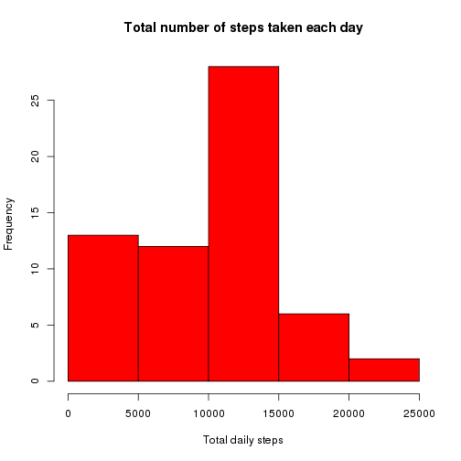
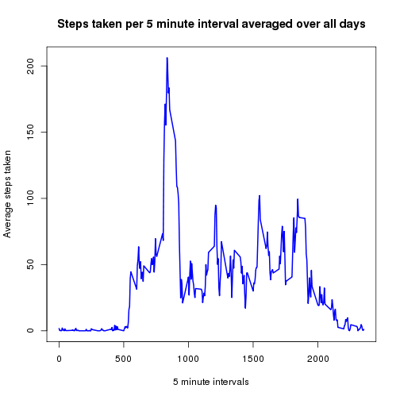
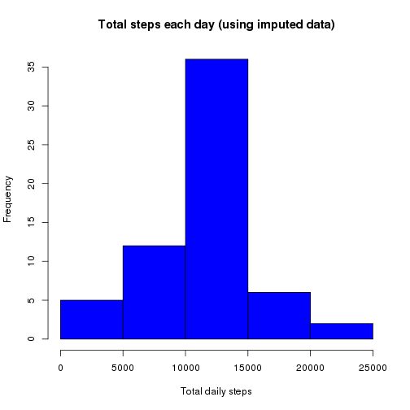

Reproducible Research - Assignment 1
========================================================

## Loading data

First read in activity data that has been downloaded from the course web site [Activity monitoring data] (https://d396qusza40orc.cloudfront.net/repdata%2Fdata%2Factivity.zip)


```r
    steps<-read.csv("activity.csv")
```

## What is mean total number of steps taken per day?

Calculate the number of steps per day.
Then make a histogram of the total number of steps taken each day.
Calculate and report the mean and median of the total number of steps taken per day.


```r
    # Calculate the total number of steps taken per day
    totdata<-aggregate(steps$steps,by=list(steps$date),FUN=sum,na.rm=TRUE)
    # Give the columns of this aggregated data sensible names
    names(totdata)[1]<-"Date"
    names(totdata)[2]<-"Total_Steps"
    hist(totdata$Total_Steps,col="red",xlab="Total daily steps",main="Total number of steps taken each day")
```

 

```r
    meantot<-round(mean(totdata$Total_Steps))
    mediantot<-median(totdata$Total_Steps)
```
The mean total steps taken per day is 9354 and the median total steps is 10395.

## What is the average daily activity pattern?

Calculate the average number of steps taken in each 5 minute interval.
Then display this as a time series plot.
Find which 5 minute interval, on average, contains the maximum number of steps.


```r
    # Calculate the average number of steps taken each interval (averaged across all days)
    avg<-aggregate(steps$steps,by=list(steps$interval),FUN=mean,na.rm=TRUE)
    # Give the columns of this aggregated data sensible names
    names(avg)[1]<-"interval"
    names(avg)[2]<-"steps"
    
    plot(avg$interval, avg$steps, type="l", xlab= "5 minute intervals", ylab= "Average steps taken", 
         main="Steps taken per 5 minute interval averaged over all days", col="blue" , lwd=2)
```

 

```r
    # Find the maximum average step value
    maxsteps <- max(avg$steps)
    # Subset the average steps data to retrieve the interval that relates to this maximum
    maxint<-subset(avg,avg$steps==maxsteps)
```
On average, across all the days in the dataset, the 5 minute interval that contains the maximum number of steps is 835.

## Imputing missing values

Calculate & report the number of missing values in the dataset (i.e. the total number of rows with NA in steps)

The following strategy has been used to fill in the missing values in the dataset:

Where there is no steps data recorded for a given date/interval, the mean for that 5 minute interval across all days will be used.  This allows for a new dataset called 'complete' to be created that is the same as the original dataset but with the missing data filled in.


```r
    # Find the number of rows where steps data is missing
    missvals<-length(which(is.na(steps$steps)))

    # Create a dataset that keeps just the rows with missing values (retain interval & date variables only) 
    missdata<-steps[!complete.cases(steps),2:3]
    
    # Merge the average steps data (calculated earlier) with this missing data
    # So the the missing data is replaced by the mean for that 5 minute interval
    imputed<-merge(avg,missdata,by="interval")
    
    # Combine this imputed data with the original data to create a new dataset called complete,
    # that is the same as the original steps dataset but with the missing data filled in.
    complete<-rbind(steps[complete.cases(steps),],imputed)
```
The total number of rows with missing values for the steps data is 2304.


```r
    # use scipen option to force R not to output numbers using scientific notation
    options("scipen"=100, "digits"=4)

    # USING THIS COMPLETE IMPUTED DATA:
    # Calculate the total number of steps taken per day
    totcomp<-aggregate(complete$steps,by=list(complete$date),FUN=sum,na.rm=TRUE)
    # Give the columns of this aggregated data sensible names
    names(totcomp)[1]<-"Date"
    names(totcomp)[2]<-"Total_Steps"
    hist(totcomp$Total_Steps,col="blue",xlab="Total daily steps",main="Total steps each day (using imputed data)")
```

 

```r
    meancomp<-round(mean(totcomp$Total_Steps))
    mediancomp<-round(median(totcomp$Total_Steps))

    # Find difference from estimates using original data that included missing values
    if(meancomp>meantot) {
        diffmean<-round(meancomp-meantot) 
        meantext<-"greater"} else {
        diffmean<-round(meantot-meancomp)
        meantext<-"less"
        }
    if(mediancomp>mediantot) {
        diffmedian<-round(mediancomp-mediantot) 
        mediantext<-"greater"} else {
        diffmedian<-round(mediantot-mediancomp)
        mediantext<-"less"
        }
```

When the missing values are imputed so the data is complete, the total number of steps taken each day is as shown in the blue histogram above.

Using this imputed data, the mean total steps taken per day is 10766 and the median total steps is 10766.

The mean value using this imputed data is 1412 greater than the mean of the original data in the first part of the assignment.

The median value using this imputed data is 371 greater than the median of the original data in the first part of the assignment.

Imputing missing data has the impact of increasing the total daily number of steps.

